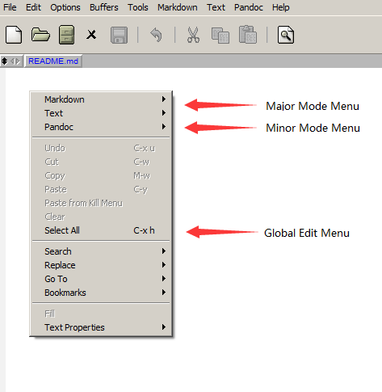
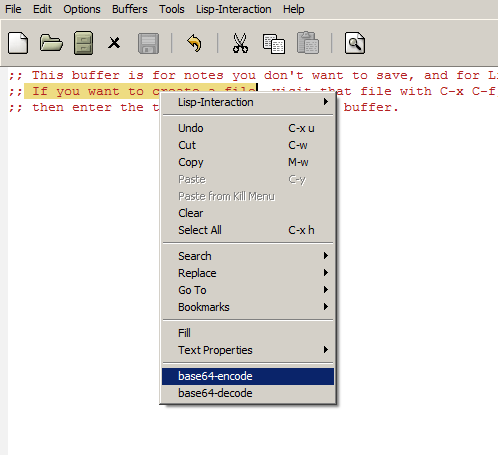

# Introduction

This Elisp package used to popup a convenient context edit menu in Emacs.

# Installation

1. If you want to install it manually, put it under some directory,
   then add that directory to the load path list, for example:
   
   ```elisp
   (add-to-list 'load-path "~/.emacs.d/lisp/")
   ```

2. Add the following codes into .emacs init file to load it.

   ```elisp
   (require 'popup-edit-menu)
   (global-set-key [mouse-3] 'popup-edit-menu)
   ```
   
   You can change the key binding as you want if you don't want to active it by mouse right click

# Usage

When you right click to active it, it show as following:



# Configuration

1. If you prefer to show the mode menus below, you can add the following codes into .emacs init file:

   ```elisp
   (setq popup-edit-menu-mode-menus-down-flag t)
   ```
   
   or set it in Emacs Customization Group.

2. If you want to add some custom menu items to that popup menu, just add to global edit menu, it will
   show on popup edit menu too. For example: use easymenu package API to add two menu items to do 
   base64 encode and decode on selected region:
   
   ```elisp
   (easy-menu-add-item nil '("edit") ["--" nil t])
   (easy-menu-add-item nil '("edit") ["base64-encode" base64-encode-region t])
   (easy-menu-add-item nil '("edit") ["base64-decode" base64-decode-region t])
   ```
   
   
